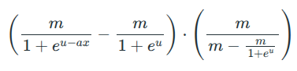
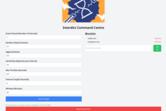
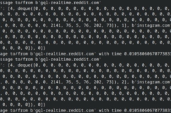
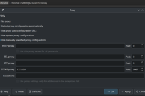
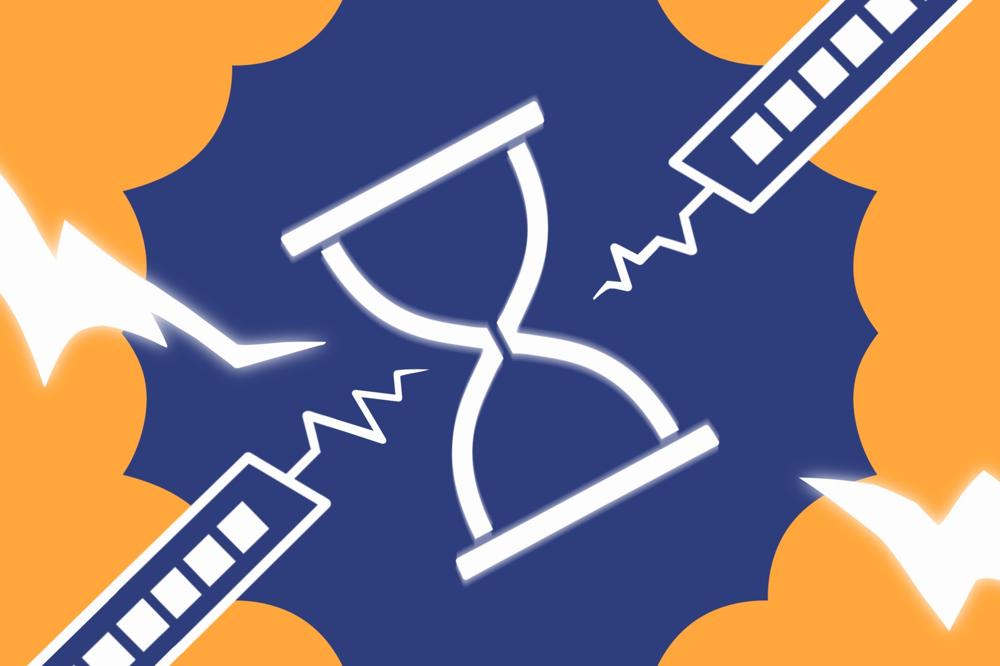

## TL;DR
**Interdict** is a revolution in effective screentime management. Completely invisible to the user, Interdict will intelligently and subtly convince your brain to slow your doomscroll and interact with addictive apps & websites in a healthy manner. Interdict is bespoke, **effective adversive conditioning tool** for your Reels addiction.

## Usage
Install:
```bash
git clone https://github.com/theokrueger/interdict
cd interdict
pip install flask
chmod +x ./ui.py ./proxy.py
```

Run:
```bash
./ui.py # run the ui configurator
./proxy.py # headlessly run proxy post-config
```


Would you be **ashamed** to show your screentime statistics to your family? Have you tried everything under the sun short of throwing your phone in a river to reduce that number? *We sure have*. The issue with conventional time-management approaches is that accountability isn't as cheap as you think it is. Why bother with a time-lock if you can just keep desperately pressing **"5 more minutes"** as you zombily stumble across the lawn of apartment fire vlogs on **Instagram Reels**?

What if a tool just made you actually ***want*** to stop the scroll instead? What if you didn't even know the tool is making you want to stop?


One glaring flaw in conventional screen time limiters is *consent*. The user *consents* to install or use this application that clearly tells you when it is in use by entirely blocking the opening of an app or website. The user can revoke this *consent* at any time, rendering the entire operation **pointless**. If a user does not know *when* they are being limited, they will not remove the feature.

Thus, the crucial hypothesis of Interdict is that **frustration** and **friction** are the antithesis of addictive apps, while silently and subtly **throttling** your connection will not alert the user to the actions being taken by Interdict. Causing this frustration won't tell you to **stop scrolling**, it will make you *want* to.

A single silent change to your proxy settings is *all it takes* to use Interdict on **any device**!


Interdict leverages the psychological technique of **adversive conditioning** to associate unwanted behaviour (doomscrolling, binging) with negative emotions (frustration) by **algorithmically throttling** your connection to problematic websites and unwanted services. Over time, you, the user, will slowly begin associating your bottomless feed with laggy video, high ping, or dropped packets that get ramped up the longer you use the service. 

In short:
- Set your device or app's proxy settings to use Interdict
- Add services you need to use less to the blocklist
- Use those services
- Get frustrated
- **Reduce your consumption**

Interdict is a **fully transparent** SOCKS5 protocol proxy server that intercepts TCP/IP traffic, written in Python. When a client uses Interdict, the proxy routes most traffic directly, unless the destination server is on a user-supplied blocked domain/address list. If it's on the list, the proxy will **track the pattern** of the client's usage over time, and then throttle packets **gradually and randomly** based on how long the client has been using the app.

By using a SOCKS5 server and looking exclusively at the destination of packets, the proxy is able to avoid looking at the content of traffic and respect TLS encryption. This entirely preserves privacy as **no logs are stored** of the content of the traffic, only the destination.

The nature of the throttling is **highly configurable**, allowing the user to modify the length of the grace period before throttling starts, rate at which the slowdown increases (agressiveness), how long of a time activity is tracked over, and more!

Each packet stream is throttled by some amount of time determined by the following formula:


Where 
*m* is the maximum throttle delay
*a* is the aggressiveness factor
*x* is the amount of time (in minutes) an application has been used over the past window of time.
*u* is a horizontal shift to the throttle curve (Hardcoded Constant)

## Additional Credits
- Alex Kotsinyan for the logo design
- CodeWithImm for SOCKS5 Proxy resources and sample code

## Gallery





